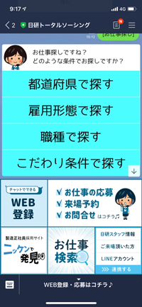
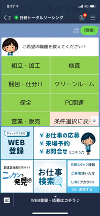
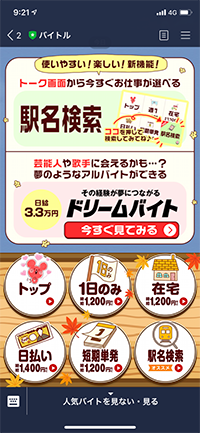
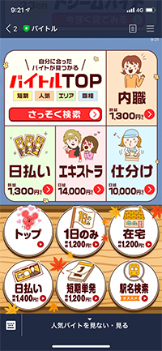
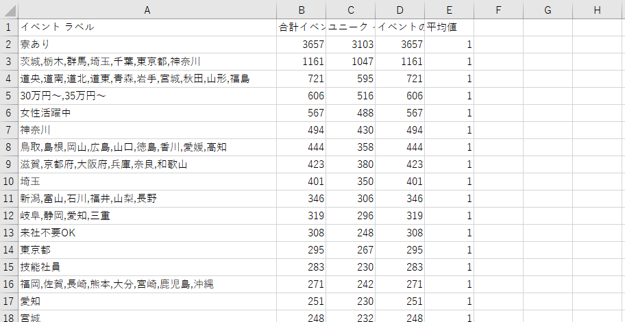
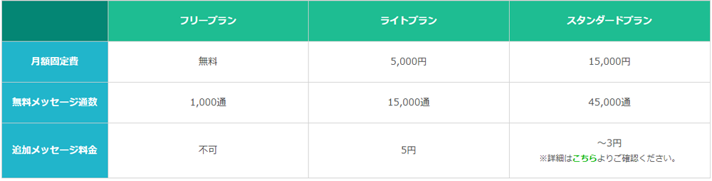

## LINE公式アカウント提案

---

### LINE公式アカウント導入目的

+++

### 採用チャネルの拡大

+++

### 現在のLINEの利用者数

8100万人
→ 今までアプローチできなかった層に接触できる

---

### 他社の公式アカウント

+++

### チャットボットで色々な機能を設けるパターン

+++

### ex)日研トータルソーシング
- チャットボットを導入することでLINEの画面のまま応募を進めることができる。

+++

### 実際の画面

+++

### メリット
 * 対話形式のLINE内で完結するので、離脱しにくい？
 * 採用したチャットボットの範囲で機能をいろいろ付けられる
 
+++

### デメリット
 * 開発・運用費用が掛かる
 * いらなくなった機能があってもやめづらい

+++

### クリエイティブを配信して自社サイトに誘導するパターン

+++

### ex)バイトル
- クリエイティブを起点にして、自社サイトでの応募を目指す
- メルマガの延長のような形

+++

### 実際の画面

+++

### メリット
 * クリエイティブさえ作れれば、予算がかからない
 * プログラムが書ければ、機能の追加、見た目のリッチ化を柔軟に行うことができる
 
+++
 
### デメリット
 * クリエイティブを作る工数がかかる
 * プログラムの保守ができないとつらいかも？

---

### 具体的な配信案

+++

### バイトルと同じようなクリエイティブから自社サイトへ促す運用

+++

### 配信内容

- メルマガのようにその時に集めたい案件を選んで、テキスト＆画像で配信(案件数、配信頻度などは配信をしながら調査していく）
- もしくは、カテゴリ・特集のクリエイティブを作成して、ナビに飛ばす

+++

### リッチメニュー

- アナリティクスで取得した、お仕事検索の上位のもので作成予定（調査済み）

+++

### その他機能＃１

問い合わせ機能 → 対応するとすれば、以下の方法が考えられる
  - エリアのLINEアカウントを作り、統括などが回答
  - コンタクト、もしくは鶴見に専任スタッフを配置
  - 工場求人ナビのお問い合わせと同様にメールで対応

+++

### その他機能＃２

画像カルーセル機能
  - 複数の画像を表示するテンプレートの作成
  - 要プログラミング

+++

### 友だちの増やし方

- 面接会場でQRコードでの宣伝
- 友だち追加広告を打つ

+++

### 費用面

配信数によって料金が変わるので、注意が必要

+++

#### 月に4回配信を行うとすると……
1通に3ふきだしまで
* 友だち250名まで無料
* 友だち3750名まで月5000円
* 友だち11250名まで月15000円

+++

### まずは下期中に250名の友達登録を目指す？
